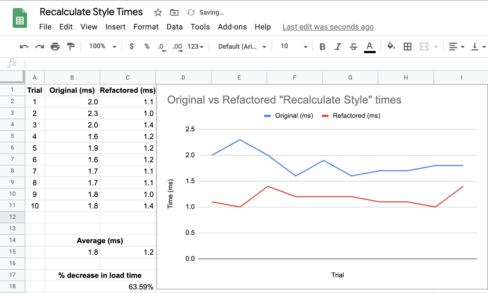

# Horiseon-refactor

## Main project goal

* This project optimizes Horiseon on search engines by improving the accessibility of their webpage

## Updates
* **Note** None of the following changes alters the visual appearance of the page

### HTML

* Replaces div containers with their semantic counterparts

* Assures that the structure of the HTML elements follow a logical structure independent of styling and positioning

* Assures that all image elements have alt attributes to improve accessibility

* Assures that the heading attributes fall in sequential order

* Assures that the title element is concise and descriptive

### CSS

* Improves codebase for long-term sustainability
* Assures that all links are functioning correctly
* Organizes CSS to follow the semantic structure of the HTML elements
    * Includes comments before each element or section
* Reworks the CSS to make it more efficient
    * Classes and ID's were added to all elements
    * Descendant combinators were avoided due to their resource intensive nature
    * The recalculated style times have decreased by 63.59% (see screenshots for results)
        * This is actually important for SEO because popular search engines factor in load speeds when ranking webpages

## Installation
* No installation is required. The webpage may be viewed [here](https://vtaymany.github.io/Horiseon-refactor/)

## Roadmap
* It is advised to switch to a CSS framework such as Bootstrap or Foundation
    * The following would allow for responsiveness across multiple viewports
    * The following would also allow you to keep classes and ID's on all elements for their performance advantages while maintaining a more standardized and scalable method of development

## Screenshots

## Credits
* [Google - Reduce the Scope and Complexity of Style Calculations](https://developers.google.com/web/fundamentals/performance/rendering/reduce-the-scope-and-complexity-of-style-calculations)
* [Google - Speed is now a landing page factor for Google Search and Ads](https://developers.google.com/web/updates/2018/07/search-ads-speed)
* [CSSwizardry - Writing efficient CSS selectors](https://csswizardry.com/2011/09/writing-efficient-css-selectors/)
* [Freecodecamp - CSS Comment Example – How To Comment Out CSS](https://www.freecodecamp.org/news/comments-in-css/)

## License
© 2020 Trilogy Education Services, a 2U, Inc. brand. All Rights Reserved.